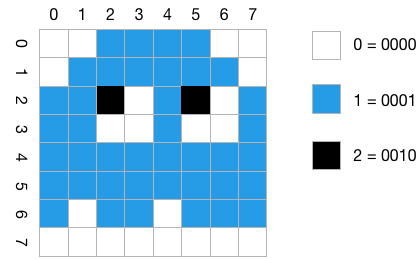

# 3. Kompression und Codierung - Übungen

## 3.1 Morse-Alphabet
Warum werden beim Morse-Alphabet manche Buchstaben mit kurzen und manche mit langen Folgen der Zeichen `.` und `-` dargestellt? Handelt es sich beim Morse-Alphabet um eine binäre Codierung? Begründen Sie Ihre Antwort.


## 3.2 Fano-Bedingung
Genügt die Deutsche Sprache der Fano-Bedingung? Begründen Sie Ihre Antwort.


## 3.3 Hamming-Distanz anpassen
Bestimmen Sie die Hamming-Distanz für den Code {1101011, 1010110, 0000011, 0001100} und modifizieren Sie diesen Code dann durch Änderung eines einzigen Bit so, dass sich eine um eins erhöhte Hamming-Distanz ergibt.

Welcher Code ergibt sich dann?


## 3.4 Parität
Geben Sie für die folgenden Bitfolgen jeweils das Paritätsbit bei _gerader (even)_ Parität an.

  * `0000000`
  * `0000010`
  * `1000000`
  * `1001001`
  * `1111111`
  * `1010101`


## 3.5 Serielle Daten dekodieren
Bei einer seriellen Datenübermittlung werden mit 7 Bit codierte ASCII-Zeichen mit einem zusätzlichen Paritätsbit und einem Längsprüfwort nach jeweils 8 Zeichen gesendet. Es gilt gerade Parität. Es wird folgende Nachricht empfangen:

```console
1000110 1
0110010 0
1100101 0
1101001 0
1100010 1
1101001 0
1100101 0
1110010 0

0100100 0
```

Wie lautet die empfangene Nachricht? Sind Übertragungsfehler aufgetreten? Wenn ja, wie lautet die korrekte Nachricht?


## 3.6 CRC-Prüfsumme berechnen
Berechnen Sie für die Nachricht `1101011010` die CRC-Prüfsumme mit dem Prüfpolynom `10011`.


## 3.7 Daten mit CRC prüfen
Sie haben die Nachricht `10101010100010` erhalten. Das Prüfpolynom ist `10001`. Ist die Nachricht korrekt übertragen worden? (Geben Sie auch den Rechenweg an.)


## 3.8 Komprimierung mit RLE
Komprimieren Sie das folgende Bild mit Hilfe eines Run-Length-Encodings (RLE). Geben Sie das Ergebnis an. Verwenden Sie der Einfachheit halber für alle Pixel eine Längenangabe und verzichten Sie auf das Markierungsbyte. Sie können anstatt der Byte-Folge einen Buchstaben für jede Farbe verwenden, z.B. `w` für weiß, `b` für blau etc.



Wieviel Platz spart Ihre Codierung im Vergleich zu einer Speicherung ohne Kompression?


## 3.9 Huffman-Code bestimmen
Erstellen Sie für das folgende Bild einen Huffman Code und codieren Sie es damit


## 3.10 Huffman-Code bestimmen
Gegeben ist folgende Häufigkeitsverteilung für eine Menge von Zeichen:

| Zeichen       | R | I | C | H | T | G |
|---------------|---|---|---|---|---|---|
| Häufigkeit [%]|25 |21 |19 |18 |13 |4  |

Generieren Sie einen Huffman-Code für die angegebene Menge

Dekodieren Sie folgende Nachricht (von links nach rechts!) `0010110100110100111` mittels des generierten Code.


## 3.11 Verlustfreie- und Verlustbehaftete Kompression
Geben Sie für die folgenden Verfahre an, ob sie verlustbehaftete oder verlustfreie Kompressionsverfahren sind:

  * RLE
  * LZ77
  * LZW
  * MP3
  * H.264 (MPEG-4)
  * FLAC
  * GZIP
  * JPEG


## 3.12 Vektorgrafik vs. Bitmap
  1. Wie funktioniert die Speicherung von Bildern als _Vektorgrafiken_? Welche Datei-Formate kennen Sie?
  2. Wie funktioniert die Speicherung von Bildern als _Bitmaps_ bzw. _Rastergrafiken_? Welche Datei-Formate kennen Sie?
  3. Welches Format sollte man für welche Art von Bildern/Grafiken einsetzen?


## 3.13 Speicherverbrauch eines Bildes
Das folgende Bild (Auflösung 640x466 Pixel) hat mit JPEG-Kompression (75% Qualität) eine Größe von 111.431 Byte.


  1. Wie viel Speicher würde man benötigen, wenn man es unkomprimiert ablegen wollte. Gehen Sie von 8 Bit pro Farbkanal (RGB) ohne Alphakanal aus. Ignorieren Sie die Header und Metadaten.
  2. Wie stark ist somit die Kompression, d.h. um welchen Faktor wird das Bild durch sie kleiner?


## 3.14 GIF oder JPEG für Comics
Warum ist das GIF-Dateiformat besser geeignet, um farbige Comics zu speichern, als JPEG? Gibt es noch ein anderes Bildformat, dass sich für Comics eignet und das möglicherweise noch besser als GIF ist?


## 3.15 JPEG in der Fotografie
Viele Fotografen speichern ihre Bilder, solange sie diese noch bearbeiten, im TIFF-Format und erzeugen JPEGs erst ganz am Ende der Bearbeitung. Warum?


## 3.16 Funktionsweise von MP3
Welche Eigenschaft des menschlichen Hörsinns wird vom MP3-Format genutzt?


