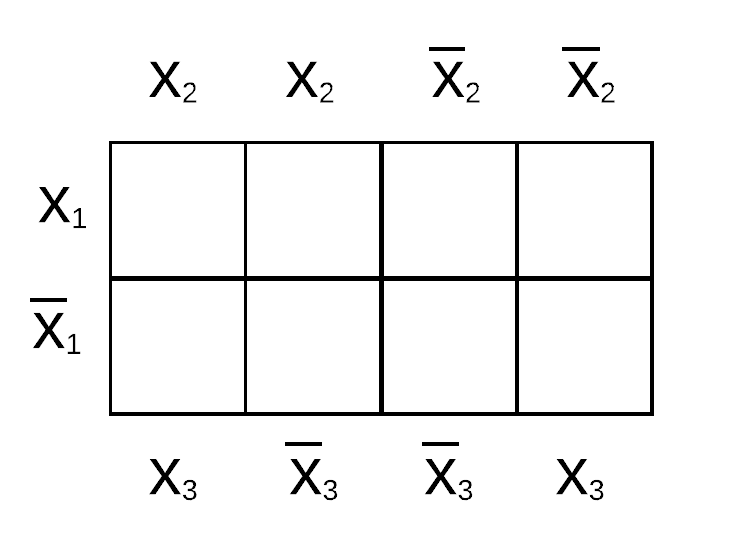
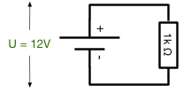
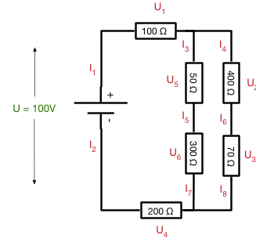

# 5. Digitale Logik - Übungen

Hinweis: Die Aufgaben verwenden der Einfachheit halber die Symbole aus Java für die Darstellung der

  * _Konjunktion_ (AND): `&`,
  * _Disjunktion_ (OR): `|` und
  * _Negation_ (NOT): `!`
  * _Exklusiv Oder_ (XOR): `^`

## 5.1 Beweis De Morgansche Gesetz
Beweisen Sie mit Hilfe einer Wahrheitstabelle das De Morgansche Gesetz:
`!(P | Q) = !P & !Q`

## 5.2 Ausdruck in Wahrheitstabelle darstellen
Stellen Sie eine Wahrheitstabelle für folgenden Ausdruck auf (P und Q sind Aussagen, die Wahr `T` oder Falsch `F` sein können): `(P & Q) | (!P & !Q)`

## 5.3 Ausdruck umformen
Vereinfachen Sie durch elementare Umformungen den folgenden Ausdruck: `(A | B) & (!A & B)`. Überprüfen Sie mit einer Wahrheitstabelle, ob das Ergebnis korrekt ist.

## 5.4 Logische Funktionen auf Bitfolgen anwenden
Berechnen Sie `(a & !b) | c` für `a = 10111011`, `b = 01101010`, `c = 10101011`. Zeigen Sie an diesem Beispiel, dass `(a & !b) | c = (a | c) & (!b | c)` gilt.

## 5.5 Logische Funktionen auf Bitfolgen anwenden
Bitte berechnen Sie `01001011 & 10101011` durch bitweise Anwendung des Operators `&`.

## 5.6 Logische Funktionen auf Bitfolgen anwenden
Bitte berechnen Sie `01001011 | 10101011` durch bitweise Anwendung des Operators `|`.

## 5.7 Logische Funktionen auf Bitfolgen anwenden
Bitte berechnen Sie `01001011 ^ 10101011` durch bitweise Anwendung des Operators `^`.

## 5.8 Bits in einem Byte umdrehen
Angenommen, Sie wollen die mittleren 4 Bits eines Bytes umdrehen (z.B. 10101001 -> 10010101), wie gehen Sie am einfachsten vor (Bitmaske und Operation)?

## 5.9 Bits maskieren
Angenommen, sie wollen in beliebigen Bitfolgen (8 Bit) die letzten beiden Bits immer auf Null setzen und das erste Bit immer auf Eins setzen, also z.B. aus `00101011` soll `10101000` werden. Wie können Sie dies mit entsprechenden booleschen Operatoren erreichen?

## 5.10 Disjunktive Normalform
Eine Schaltfunktion y mit drei Eingängen x1, x2, x3 sei durch folgende Funktionstabelle gegeben:

| x1  | x2  | x3  | y  |
|-----|-----|-----|----|
|  0  |   0 |   0 |  0 |
|  0  |   0 |   1 |  1 |
|  0  |   1 |   0 |  1 |
|  0  |   1 |   1 |  0 |
|  1  |   0 |   0 |  0 |
|  1  |   0 |   1 |  1 |
|  1  |   1 |   0 |  1 |
|  1  |   1 |   1 |  1 |

Geben Sie die Schaltfunktion in disjunktiver Normalform an, erstellen Sie das zugehörige KV-Diagramm und vereinfachen Sie die Funktion so weit wie möglich.

## 5.11 Gatter erstellen
Erstellen Sie eine Wertetabelle und einen Schaltplan mit möglichst wenig Gattern für die folgende Schaltfunktion:

`f(x1, x2, x3) = (x1 & x2 & !x3) | (x1 & !x2 & !x3)`.

## 5.12 Oder-Gatter mit vier Eingängen
Entwerfen Sie unter Verwendung von Gattern mit zwei Eingängen ein Oder-Gatter mit vier Eingängen.

## 5.13 Schaltung entwerfen
Entwerfen Sie eine Schaltung mit Gattern, die prüft ob einer der Passagiere seinen Gurt geschlossen hat (High-Signal vom Gurtsensor). Ist der Platz leer (Low-Signal vom Sitzplatzsensor) so darf auch der Gurt offen sein. Ist der Platz besetzt und der Gurt offen soll die Schaltung ein High-Signal ausgeben. Verknüpfen Sie dann zwei Sitzplätze zu einem Ergebnis-Signal.

Entwerfen Sie zuerst eine Wahrheitstabelle und geben Sie dann eine Schaltung mit Gattern an.

## 5.14 Leistung einer Schaltung
Berechnen Sie für den unten angegebenen Stromkreis, welche Leistung (in Watt) verbraucht wird.

## 5.15 Länge eines Kabels USA vs. Europa
In den USA (Netzspannung 120 V) können die Kabel bei gleicher Dicke ungefähr nur ein Viertel (25%) der Länge von Kabeln in Europa (Netzspannung 230V) haben. Warum ist dies so?

## 5.16 Schaltkreis berechnen
Berechnen Sie für den unten angegebenen Stromkreis alle fehlenden Größen.

