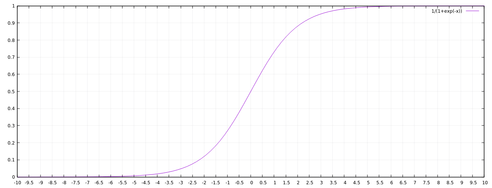

# 9. Künstliche Intelligenz - Test (100 Punkte)

## 9.1 Typologie künstlicher Intelligenz (15 Punkte)
Man unterscheidet häufig _vier Typen_ (oder Stufen) von künstlicher Intelligenz. Bitte erläutern Sie diese kurz.

## 9.2 Neuron (15 Punkte)
Ein künstliches Neuronales Netz besteht aus sogenannten _künstlichen Neuronen_. Welche der folgenden Aussagen über ein solches Neuron sind korrekt?

  * [ ] es verwendet einen Übertragungsfunktion, um die gewichteten Eingaben zusammenzufassen
  * [ ] es hat mehrere Ausgänge
  * [ ] es hat mehrere Eingänge
  * [ ] es basiert auf dem Modell einer biologischen Nervenzelle
  * [ ] es bestimmt seine Ausgabe durch eine Aktivierungsfunktion
  * [ ] es hat genau einen Ausgang
  * [ ] es hat einen Schwellwert
  * [ ] es verwendet einen Aktivierungsfunktion, um die gewichteten Eingaben zusammenzufassen
  * [ ] es hat genau einen Eingang
  * [ ] es bestimmt seine Ausgabe durch eine Übertragungsfunktion
  * [ ] es gewichtet seine Eingaben

## 9.3 Künstliche Intelligenz? (10 Punkte)
Bei welchen der folgenden Dinge handelt es sich um künstliche Intelligenz?

  * [ ] Den Aktienmarkt durch das Anpassen einer Kurve an vergangene Aktienpreise vorhersagen
  * [ ] Filter zur Übertragung von Kunststilen (Impressionismus, Kubismus, etc.) auf beliebige Fotos
  * [ ] Big-Data-Lösungen, die große Mengen von Daten speichern, verarbeiten und an viele Nutzer gleichzeitig verteilen können
  * [ ] Die schnellste Route in einem GPS-Navigationssystem suchen
  * [ ] Bildbearbeitung, z.B. die Anpassung von Helligkeit und Kontrast in Photoshop
  * [ ] Tabellenkalkulation, die eine Summen und andere Funktionen für die gegebenen Daten ausrechnet
  * [ ] Musikempfehlungen (z.B. bei Spotify) basierend auf dem Hörverhalten

## 9.4 Deep Learning (15 Punkte)
Welche der folgenden Aussagen _trifft_ auf _Deep Learning_ zu?

  * [ ] ist der Oberbegriff für Maschinelles Lernen
  * [ ] ermöglichen auch bei neuronalen Netzen mit zahlreichen Zwischenlagen einen stabilen Lernerfolg
  * [ ] wird bei neuronalen Netzen mit vielen Zwischenlagen angewendet
  * [ ] ist eine Optimierungsmethode für künstliche neuronale Netze
  * [ ] wird häufig zusammen mit klassischer Konditionierung eingesetzt
  * [ ] ist eine Teilmenge des Maschinellen Lernens
  * [ ] ist ein biologischer Vorgang bei dem Neuronen sich tief vernetzen

## 9.5 Backpropagation (15 Punkte)
Welche der folgenden Aussagen über _Backpropagation_ treffen zu?

  * [ ] die Zielwerte müssen bekannt sein
  * [ ] funktioniert auch bei unbekannten Zielwerten
  * [ ] dient dazu, die letzte Schicht (Backplane) in einem künstlichen neuronalen Netz zu strukturieren
  * [ ] gehört zu den Verfahren des unsupervised learning
  * [ ] dient dem Einlernen von künstliche neuronalen Netzen
  * [ ] gehört zu den Verfahren des supervised learning

## 9.6 Möglichkeiten und Grenzen der KI (15 Punkte)
Welche der folgenden Aussagen über Künstliche Intelligenz treffen zu?

  * [ ] KIs können selbständig Retro-Spiele wie Super Mario lernen und spielen
  * [ ] KIs können Autos autonom fahren lassen
  * [ ] KIs schlagen Profispieler bei Go
  * [ ] KIs erreichen ähnliche intellektuelle Fähigkeiten wie Menschen
  * [ ] KIs bestehen den Turing-Test zuverlässig
  * [ ] KIs können Flugzeuge autonom steuern
  * [ ] KIs schlagen Profispieler bei Schach

## 9.7 Berechnungen an einem Neuron (15 Punkte)
Gegeben sei ein künstliches Neuron mit drei Eingängen (x1, x2 und x3) (und einem Ausgang a). Die Gewichte für die drei Eingänge sind:

`(w1, w2, w3) = (0.3, 0.5, 0.2)`

Als Aktivierungsfunktion wird die Sigmoid-Funktion verwendet, wobei vorher noch ein Bias addiert wird. Der Bias beträgt konstant -1.0. Den Verlauf der Sigmoid-Funktion `f` für das Neuron können Sie aus folgender Grafik ableiten (`f(x) = 1 / (1 + exp(-x))`):

Berechnen Sie für folgende Werte die Ausgabe des Neurons:

`(x1, x2, x3) = (0.0, 2.0, 0.0)`

